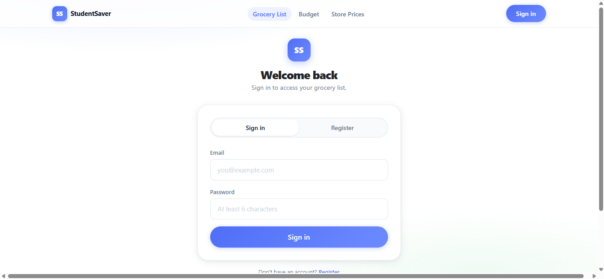
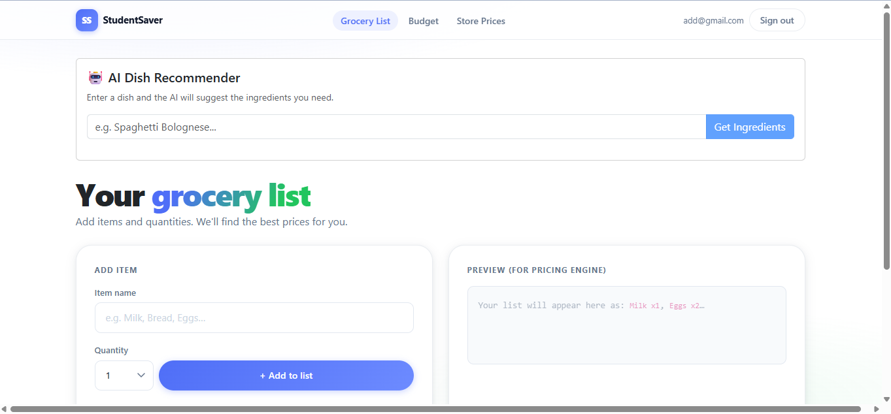
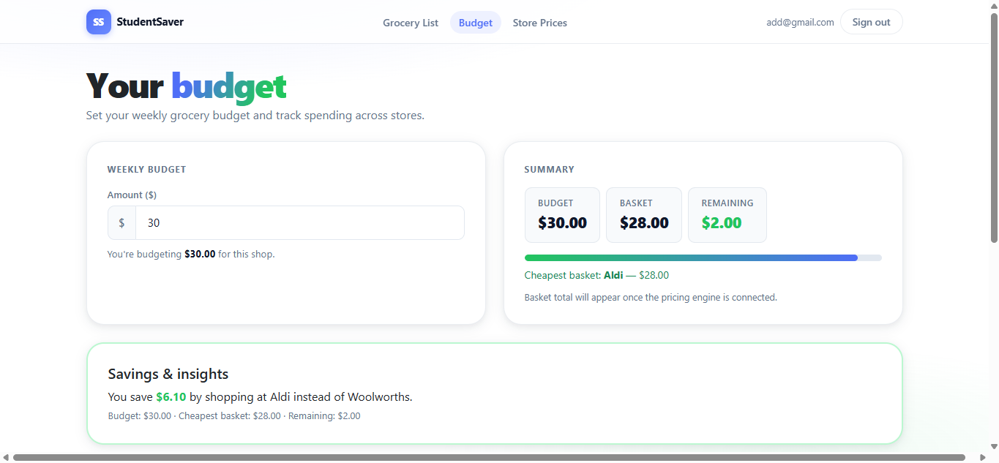
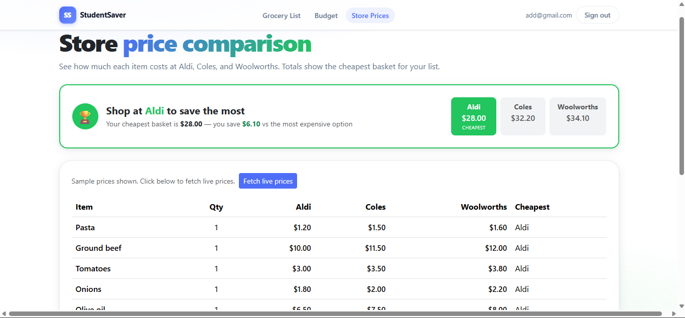
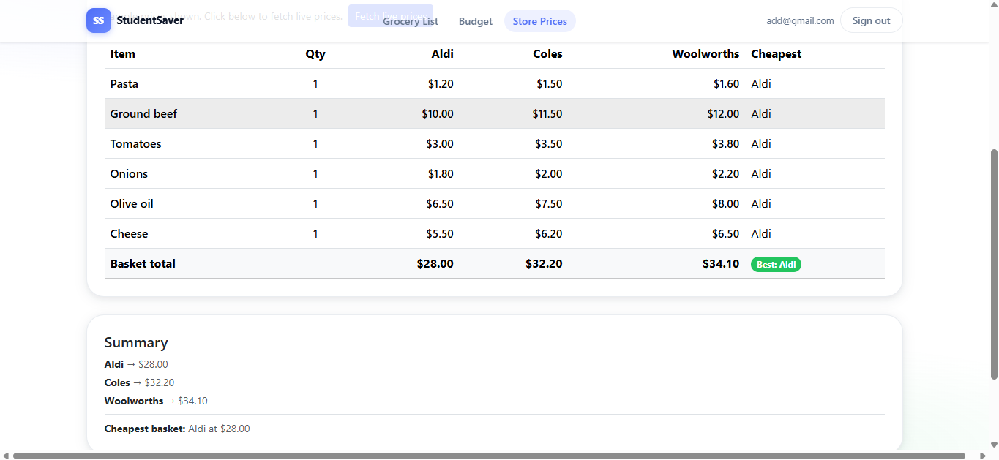

# GrocerySaver

GrocerySaver is a budgeting helper built for students, focused on making it easier to track grocery spending, save money, and stay on top of everyday expenses. Built during UNIHACK 2026 by StudentSaver Team.

[](mailto:mike.lemanh@gmail.com)
[](https://www.linkedin.com/in/mike-le-13a177140/)

## Overview

GrocerySaver is designed for one primary user group:

- **Students**:
  - Sign up and sign in using their email and password via Firebase Authentication.
  - Build and manage a personal grocery list with item search, autocomplete, and quantity selection.
  - Remove or update item quantities directly within their list at any time.
  - Have their grocery list automatically saved to the cloud via Firestore, persisting across sessions and page refreshes.

## Key Features

- **Firebase Authentication** — Secure email/password sign up, sign in, and sign out
- **Grocery List Builder** — Add and remove items with quantity selection (1–20) and search autocomplete
- **Cloud Persistence** — Grocery list is saved to Firestore per user and survives page refresh and session changes
- **Responsive UI** — Built with Bootstrap for a clean, mobile-friendly layout
- **Fast Deployment** — Hosted on Vercel with automatic CI/CD from GitHub

## Architecture & Technologies

- **Frontend:** Next.js 15 (React) + Bootstrap
- **Auth:** Firebase Authentication
- **Database:** Cloud Firestore
- **Hosting:** Vercel
- **Language:** JavaScript / TypeScript

## Screenshots

This is what our GrocerySaver looks alike:

<div style="display: flex; flex-wrap: wrap; justify-content: space-around;">

  <div style="flex: 0 0 45%; margin-bottom: 10px;">
    
    <p align="center"><strong>Login/Register Page</strong></p>
  </div>

  <div style="flex: 0 0 45%; margin-bottom: 10px;">
    
    <p align="center"><strong>Home Page</strong></p>
  </div>

  <div style="flex: 0 0 45%; margin-bottom: 10px;">
    
    <p align="center"><strong>User puts on their Budget on this page</strong></p>
  </div>

  <div style="flex: 0 0 45%; margin-bottom: 10px;">
    
    <p align="center"><strong>Store Price Comparison Page</strong></p>
  </div>

  <div style="flex: 0 0 45%; margin-bottom: 10px;">
    
    <p align="center"><strong>User views the price comparison between stores</strong></p>
  </div>

</div>

## Getting Started

### Prerequisites

Before running this project, make sure you have the following installed and configured:

- [Node.js](https://nodejs.org/) (v18 or higher)
- [npm](https://www.npmjs.com/) (v9 or higher)
- A [Firebase](https://console.firebase.google.com/)  project with:
  - Email/Password Authentication enabled
  - Cloud Firestore database created
- A [Vercel](https://vercel.com/) account (for deployment)

### Installation

1. **Clone the repository:**

   ```bash
   git clone https://github.com/WebManDev/grocery-saver.git
   cd grocery-saver
   ```

2. **Install dependencies**

   ```bash
   npm install
   ```

3. **Configure Firebase**

   Create a .env.local file in the root directory and add your Firebase project credentials:
   ```env
   NEXT_PUBLIC_FIREBASE_API_KEY=your_api_key
   NEXT_PUBLIC_FIREBASE_AUTH_DOMAIN=your_auth_domain
   NEXT_PUBLIC_FIREBASE_PROJECT_ID=your_project_id
   NEXT_PUBLIC_FIREBASE_STORAGE_BUCKET=your_storage_bucket
   NEXT_PUBLIC_FIREBASE_MESSAGING_SENDER_ID=your_sender_id
   NEXT_PUBLIC_FIREBASE_APP_ID=your_app_id
   ```

4. **Deploy Firestore security rules**

   ```bash
   firebase deploy --only firestore:rules
   ```
   
   Run the development server
   ```bash
   npm run dev
   ```

5. **Access the Application:**

   Open your browser and navigate to [http://localhost:3000](http://localhost:3000).

## Usage

- Sign up for an account using your email and password.
- Sign in to access your personal grocery list.
- Add items to your list by searching or typing the item name, then selecting a quantity.
- Edit quantities directly in the list rows as needed.
- Remove items you no longer need with the remove button.
- Your list is automatically saved to the cloud — it will be there next time you sign in.

## Contributing

Contributions are welcome! Review our [CONTRIBUTING.md](CONTRIBUTING.md) file for guidelines on how to contribute.

## License

This project is licensed under the Apache License 2.0 —  See the [LICENSE](LICENSE) file for full details.

Copyright 2026 Mike Le (mikeleworkshop)

---

GrocerySaver is built to make grocery budgeting simple, accessible, and stress-free for students everywhere — putting smarter spending habits just a few clicks away. Feedback and contributions are highly appreciated!

Best Greets,
Mike

